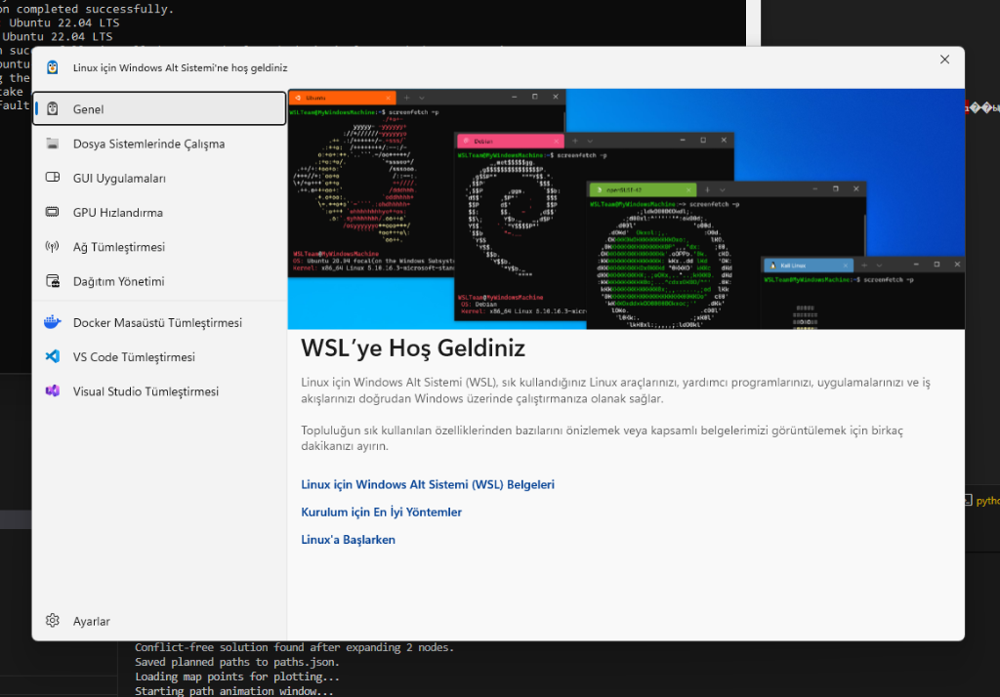
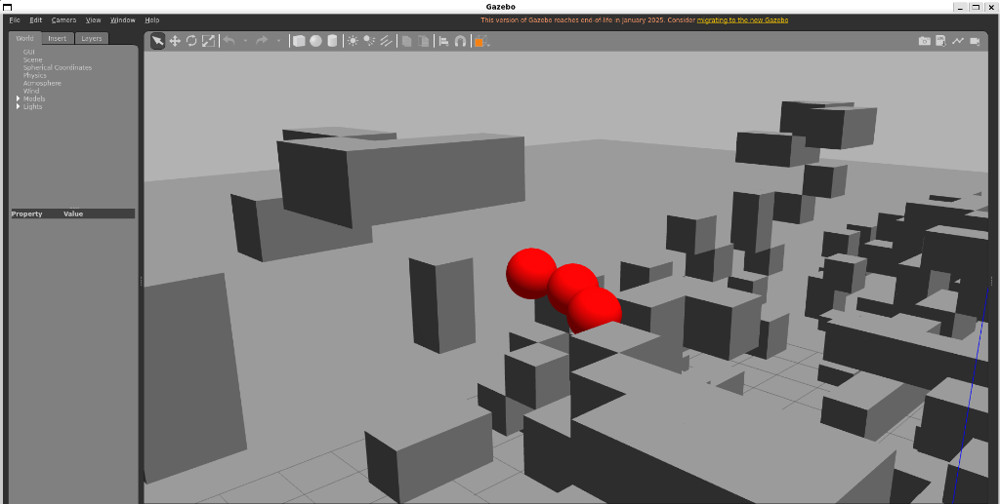

# Multi-UAVs Collaborative Path Planning in the Cramped Environment

Bu proje, dar/sıkışık alanlarda (cramped environments) çoklu İnsansız Hava Araçlarının (İHA) güvenli, pürüzsüz ve birbiriyle çakışmayan rotalar çizmesini sağlayan akademik bir yol planlama kütüphanesidir. Proje, Siyuan Feng ve ark. (Şubat 2024) tarafından yayınlanan **"Multi-UAVs Collaborative Path Planning in the Cramped Environment"** makalesinde sunulan teorik temellere dayanmaktadır.

Windows sistemlerde güvenlik politikaları nedeniyle C++ yürütülebilir dosyalarının (`.exe`) engellenmesini aşmak ve projenin taşınabilirliğini artırmak amacıyla, sistemin tüm bileşenleri **Python** diline yüksek performanslı algoritmik yaklaşımlarla aktarılmıştır.

---

## 🚀 Proje Özellikleri ve Matematiksel Altyapı

Proje, makalede önerilen iki seviyeli hiyerarşik planlama çerçevesini (hierarchical framework) birebir uygular:

1. **Yüksek Seviye Planlama (Enhanced Conflict-Based Search - ECBS):**
   - İHA'lar arasındaki uzay-zaman çatışmalarını (space-time conflicts) tespit eder.
   - Çatışma Ağacı (Constraint Tree) üzerinde dallanma yaparak çatışmaları çözen en uygun kısıtları (constraints) üretir.
2. **Düşük Seviye Planlama (Kinodynamic A*):**
   - İHA'ların fiziksel ivme ve hız sınırlarına uyan, pürüzsüz 3D yollar üretmek için hareket ilkellerini (motion primitives) kullanır.
   - Öncelikli kuyruk (`heapq`) optimizasyonu ile çatışmasızlığa öncelik veren hibrit bir arama yürütür.
3. **Elipsoid Downwash Çarpışma Modeli:**
   - İHA'ların aerodinamik olarak motorlarının oluşturduğu aşağı yönlü rüzgar etkisini (downwash) hesaba katan dikey eksende daha geniş ($r_x=r_y=0.15$m, $r_z=0.5$m) bir elipsoid model kullanılır.
4. **Voxel Grid Haritası:**
   - `10X30m.pcd` 3D nokta bulutu haritasını voxel hücrelerine ayırarak doluluk durumunu hafızada saklar ve $O(1)$ sürede engel sorgulaması sunar.

---

## 📦 Kurulum ve Gereksinimler

Projenin çalışması için sisteminizde Python 3 ve aşağıdaki kütüphanelerin yüklü olması gerekmektedir:

```bash
pip install numpy matplotlib
```

---

## 💻 Kullanım

### 1. Python & Matplotlib 3D Simülasyonu (Windows)
Planlayıcıyı çalıştırıp hızlı Matplotlib 3D canlandırmasını başlatmak için:
```bash
python main.py
```

**Planlama Çıktısı (Matplotlib):**


### 2. ROS 2 & Gazebo 11 Simülasyonu (WSL2 / Linux)
Simülasyonu gerçek fizik motoru ve 3D görselleştirme ile Gazebo'da çalıştırmak için:
1. WSL2 Ubuntu terminalinizi açın.
2. Proje dizinine gidin ve tek seferlik kurulum scriptini çalıştırın:
   ```bash
   bash install_ros_gazebo.sh
   ```
3. Kurulum tamamlandıktan sonra, simülasyonu derlemek ve başlatmak için şu komutu çalıştırın:
   ```bash
   bash build_and_run_gazebo.sh
   ```

**Gazebo Simülasyon Çıktısı:**


---

## 📂 Dosya Yapısı

* `main.py` - Projenin ana giriş noktası, simülasyon senaryoları ve 3D Matplotlib canlandırma motoru.
* `ecbs.py` - Üst seviyeli çatışma çözücü algoritma (Conflict-Based Search).
* `kinodynamic_astar.py` - Düşük seviyeli kinodinamik arama algoritması.
* `collision_detector.py` - Engellerle ve diğer İHA'larla (downwash dahil) çarpışma kontrolleri.
* `voxel_map.py` - PCD formatındaki 3D haritaları okuma ve voxel tabanlı sorgulama.
* `pcd_to_gazebo.py` - PCD haritasını Gazebo 3D dünyasına (`cramped_env.world`) dönüştüren script.
* `build_and_run_gazebo.sh` - Gazebo simülasyonunu derleyip başlatan kabuk betiği.
* `install_ros_gazebo.sh` - ROS 2 ve Gazebo kurulum betiği.
* `ros2_ws/` - Simülasyonun ROS 2 kaynak kodlarını içeren workspace klasörü (`src/multi_uav_sim`).
* `Map/` - 3D nokta bulutu formatındaki harita verileri (`10X30m.pcd`).
